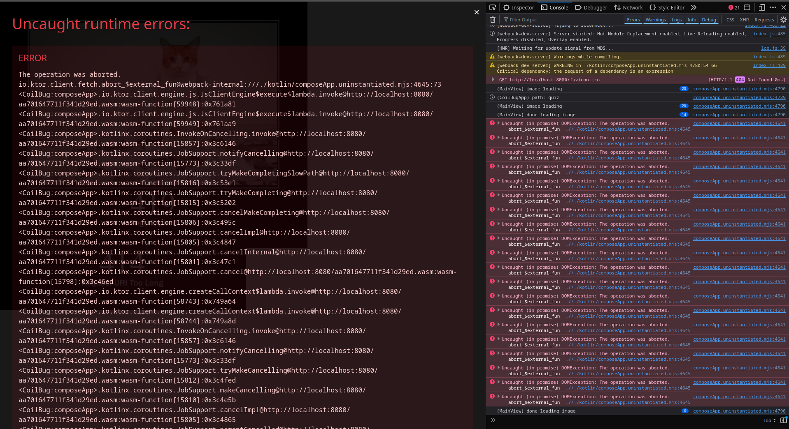

# Coil possible bug reproduction

1. `:composeApp:wasmJsBrowserDevelopmentRun`
2. http://localhost:8080/#quiz
3. reload multiple times to produce error

source of exception:
- [App.kt#30](composeApp/src/wasmJsMain/kotlin/ch/whatever/App.kt#L30)
- [MainScreen.kt#30](composeApp/src/wasmJsMain/kotlin/ch/whatever/MainScreen.kt#L69)

exception:
```
Uncaught runtime errors:
ERROR
The operation was aborted. 
io.ktor.client.fetch.abort_$external_fun@webpack-internal:///./kotlin/composeApp.uninstantiated.mjs:4645:73
<CoilBug:composeApp>.io.ktor.client.engine.js.JsClientEngine$execute$lambda.invoke@http://localhost:8080/aa701647711f341d29ed.wasm:wasm-function[59948]:0x761a81
<CoilBug:composeApp>.io.ktor.client.engine.js.JsClientEngine$execute$lambda.invoke@http://localhost:8080/aa701647711f341d29ed.wasm:wasm-function[59949]:0x761aa9
<CoilBug:composeApp>.kotlinx.coroutines.InvokeOnCancelling.invoke@http://localhost:8080/aa701647711f341d29ed.wasm:wasm-function[15857]:0x3c6146
<CoilBug:composeApp>.kotlinx.coroutines.JobSupport.notifyCancelling@http://localhost:8080/aa701647711f341d29ed.wasm:wasm-function[15773]:0x3c33df
<CoilBug:composeApp>.kotlinx.coroutines.JobSupport.tryMakeCompletingSlowPath@http://localhost:8080/aa701647711f341d29ed.wasm:wasm-function[15816]:0x3c53e1
<CoilBug:composeApp>.kotlinx.coroutines.JobSupport.tryMakeCompleting@http://localhost:8080/aa701647711f341d29ed.wasm:wasm-function[15815]:0x3c5202
<CoilBug:composeApp>.kotlinx.coroutines.JobSupport.cancelMakeCompleting@http://localhost:8080/aa701647711f341d29ed.wasm:wasm-function[15806]:0x3c495c
<CoilBug:composeApp>.kotlinx.coroutines.JobSupport.cancelImpl@http://localhost:8080/aa701647711f341d29ed.wasm:wasm-function[15805]:0x3c4847
<CoilBug:composeApp>.kotlinx.coroutines.JobSupport.cancelInternal@http://localhost:8080/aa701647711f341d29ed.wasm:wasm-function[15801]:0x3c47c1
<CoilBug:composeApp>.kotlinx.coroutines.JobSupport.cancel@http://localhost:8080/aa701647711f341d29ed.wasm:wasm-function[15798]:0x3c46ed
<CoilBug:composeApp>.io.ktor.client.engine.createCallContext$lambda.invoke@http://localhost:8080/aa701647711f341d29ed.wasm:wasm-function[58743]:0x749a64
<CoilBug:composeApp>.io.ktor.client.engine.createCallContext$lambda.invoke@http://localhost:8080/aa701647711f341d29ed.wasm:wasm-function[58744]:0x749a8d
<CoilBug:composeApp>.kotlinx.coroutines.InvokeOnCancelling.invoke@http://localhost:8080/aa701647711f341d29ed.wasm:wasm-function[15857]:0x3c6146
<CoilBug:composeApp>.kotlinx.coroutines.JobSupport.notifyCancelling@http://localhost:8080/aa701647711f341d29ed.wasm:wasm-function[15773]:0x3c33df
<CoilBug:composeApp>.kotlinx.coroutines.JobSupport.tryMakeCancelling@http://localhost:8080/aa701647711f341d29ed.wasm:wasm-function[15812]:0x3c4fed
<CoilBug:composeApp>.kotlinx.coroutines.JobSupport.makeCancelling@http://localhost:8080/aa701647711f341d29ed.wasm:wasm-function[15810]:0x3c4e5b
<CoilBug:composeApp>.kotlinx.coroutines.JobSupport.cancelImpl@http://localhost:8080/aa701647711f341d29ed.wasm:wasm-function[15805]:0x3c4865
<CoilBug:composeApp>.kotlinx.coroutines.JobSupport.parentCancelled@http://localhost:8080/aa701647711f341d29ed.wasm:wasm-function[15802]:0x3c47d7
<CoilBug:composeApp>.kotlinx.coroutines.ChildHandleNode.invoke@http://localhost:8080/aa701647711f341d29ed.wasm:wasm-function[15867]:0x3c62c8
<CoilBug:composeApp>.kotlinx.coroutines.JobSupport.notifyCancelling@http://localhost:8080/aa701647711f341d29ed.wasm:wasm-function[15773]:0x3c33df
<CoilBug:composeApp>.kotlinx.coroutines.JobSupport.tryMakeCancelling@http://localhost:8080/aa701647711f341d29ed.wasm:wasm-function[15812]:0x3c4fed
<CoilBug:composeApp>.kotlinx.coroutines.JobSupport.makeCancelling@http://localhost:8080/aa701647711f341d29ed.wasm:wasm-function[15810]:0x3c4e5b
<CoilBug:composeApp>.kotlinx.coroutines.JobSupport.cancelImpl@http://localhost:8080/aa701647711f341d29ed.wasm:wasm-function[15805]:0x3c4865
<CoilBug:composeApp>.kotlinx.coroutines.JobSupport.parentCancelled@http://localhost:8080/aa701647711f341d29ed.wasm:wasm-function[15802]:0x3c47d7
<CoilBug:composeApp>.kotlinx.coroutines.ChildHandleNode.invoke@http://localhost:8080/aa701647711f341d29ed.wasm:wasm-function[15867]:0x3c62c8
<CoilBug:composeApp>.kotlinx.coroutines.JobSupport.notifyCancelling@http://localhost:8080/aa701647711f341d29ed.wasm:wasm-function[15773]:0x3c33df
<CoilBug:composeApp>.kotlinx.coroutines.JobSupport.tryMakeCancelling@http://localhost:8080/aa701647711f341d29ed.wasm:wasm-function[15812]:0x3c4fed
<CoilBug:composeApp>.kotlinx.coroutines.JobSupport.makeCancelling@http://localhost:8080/aa701647711f341d29ed.wasm:wasm-function[15810]:0x3c4e5b
<CoilBug:composeApp>.kotlinx.coroutines.JobSupport.cancelImpl@http://localhost:8080/aa701647711f341d29ed.wasm:wasm-function[15805]:0x3c4865
<CoilBug:composeApp>.kotlinx.coroutines.JobSupport.cancelInternal@http://localhost:8080/aa701647711f341d29ed.wasm:wasm-function[15801]:0x3c47c1
<CoilBug:composeApp>.kotlinx.coroutines.JobSupport.cancel@http://localhost:8080/aa701647711f341d29ed.wasm:wasm-function[15798]:0x3c46ed
<CoilBug:composeApp>.kotlinx.coroutines.Job.cancel$default@http://localhost:8080/aa701647711f341d29ed.wasm:wasm-function[15629]:0x3c0e05
<CoilBug:composeApp>.coil3.compose.AsyncImagePainter.<set-rememberJob>@http://localhost:8080/aa701647711f341d29ed.wasm:wasm-function[54479]:0x6f7de0
<CoilBug:composeApp>.coil3.compose.AsyncImagePainter.onForgotten@http://localhost:8080/aa701647711f341d29ed.wasm:wasm-function[54509]:0x6f8232
<CoilBug:composeApp>.coil3.compose.internal.ContentPainterNode.onDetach@http://localhost:8080/aa701647711f341d29ed.wasm:wasm-function[54661]:0x6fb8c2
<CoilBug:composeApp>.androidx.compose.ui.Node.runDetachLifecycle@http://localhost:8080/aa701647711f341d29ed.wasm:wasm-function[33895]:0x53c2d1
<CoilBug:composeApp>.androidx.compose.ui.node.NodeChain.runDetachLifecycle@http://localhost:8080/aa701647711f341d29ed.wasm:wasm-function[37874]:0x59b6a2
<CoilBug:composeApp>.androidx.compose.ui.node.LayoutNode.detach@http://localhost:8080/aa701647711f341d29ed.wasm:wasm-function[37095]:0x587d6d
<CoilBug:composeApp>.androidx.compose.ui.node.LayoutNode.detach@http://localhost:8080/aa701647711f341d29ed.wasm:wasm-function[37095]:0x587def
<CoilBug:composeApp>.androidx.compose.ui.node.LayoutNode.detach@http://localhost:8080/aa701647711f341d29ed.wasm:wasm-function[37095]:0x587def
<CoilBug:composeApp>.androidx.compose.ui.node.LayoutNode.onChildRemoved@http://localhost:8080/aa701647711f341d29ed.wasm:wasm-function[37088]:0x587382
<CoilBug:composeApp>.androidx.compose.ui.node.LayoutNode.removeAt@http://localhost:8080/aa701647711f341d29ed.wasm:wasm-function[37086]:0x58728d
<CoilBug:composeApp>.androidx.compose.ui.platform.DefaultUiApplier.remove@http://localhost:8080/aa701647711f341d29ed.wasm:wasm-function[40207]:0x5be628
<CoilBug:composeApp>.androidx.compose.runtime.changelist.RemoveNode.execute@http://localhost:8080/aa701647711f341d29ed.wasm:wasm-function[23286]:0x4425a8
<CoilBug:composeApp>.androidx.compose.runtime.changelist.Operations.executeAndFlushAllPendingOperations@http://localhost:8080/aa701647711f341d29ed.wasm:wasm-function[23451]:0x445e15
<CoilBug:composeApp>.androidx.compose.runtime.changelist.ChangeList.executeAndFlushAllPendingChanges@http://localhost:8080/aa701647711f341d29ed.wasm:wasm-function[23043]:0x4384da
<CoilBug:composeApp>.androidx.compose.runtime.CompositionImpl.applyChangesInLocked@http://localhost:8080/aa701647711f341d29ed.wasm:wasm-function[21704]:0x41440e
<CoilBug:composeApp>.androidx.compose.runtime.CompositionImpl.applyChanges@http://localhost:8080/aa701647711f341d29ed.wasm:wasm-function[21705]:0x414a1d
<CoilBug:composeApp>.androidx.compose.runtime.Recomposer$runRecomposeAndApplyChanges$slambda$lambda.invoke@http://localhost:8080/aa701647711f341d29ed.wasm:wasm-function[22044]:0x41e59b
<CoilBug:composeApp>.androidx.compose.runtime.Recomposer$runRecomposeAndApplyChanges$slambda$lambda.invoke@http://localhost:8080/aa701647711f341d29ed.wasm:wasm-function[22045]:0x41ed2e
<CoilBug:composeApp>.androidx.compose.runtime.FrameAwaiter.resume@http://localhost:8080/aa701647711f341d29ed.wasm:wasm-function[21102]:0x401dc4
<CoilBug:composeApp>.androidx.compose.runtime.BroadcastFrameClock.sendFrame@http://localhost:8080/aa701647711f341d29ed.wasm:wasm-function[21120]:0x402476
<CoilBug:composeApp>.androidx.compose.ui.scene.BaseComposeScene.render@http://localhost:8080/aa701647711f341d29ed.wasm:wasm-function[40650]:0x5c5b05
<CoilBug:composeApp>.androidx.compose.ui.window.<no name provided>.onRender@http://localhost:8080/aa701647711f341d29ed.wasm:wasm-function[41315]:0x5d254f
<CoilBug:composeApp>.org.jetbrains.skiko.<no name provided>.drawFrame@http://localhost:8080/aa701647711f341d29ed.wasm:wasm-function[28896]:0x4c4d98
<CoilBug:composeApp>.org.jetbrains.skiko.CanvasRenderer$needRedraw$lambda.invoke@http://localhost:8080/aa701647711f341d29ed.wasm:wasm-function[28863]:0x4c4718
<CoilBug:composeApp>.org.jetbrains.skiko.CanvasRenderer$needRedraw$lambda.invoke@http://localhost:8080/aa701647711f341d29ed.wasm:wasm-function[28864]:0x4c4771
<CoilBug:composeApp>.org.w3c.dom.__callFunction_((Double)->Unit)@http://localhost:8080/aa701647711f341d29ed.wasm:wasm-function[18326]:0x3f152f
org.w3c.dom.__convertKotlinClosureToJsClosure_((Double)->Unit)/<@webpack-internal:///./kotlin/composeApp.uninstantiated.mjs:1195:124
FrameRequestCallback*org.jetbrains.skiko.w3c.requestAnimationFrame_$external_fun@webpack-internal:///./kotlin/composeApp.uninstantiated.mjs:4378:94
<CoilBug:composeApp>.org.jetbrains.skiko.w3c.requestAnimationFrame_$external_fun__externalAdapter@http://localhost:8080/aa701647711f341d29ed.wasm:wasm-function[28925]:0x4c504f
<CoilBug:composeApp>.org.jetbrains.skiko.CanvasRenderer.needRedraw@http://localhost:8080/aa701647711f341d29ed.wasm:wasm-function[28880]:0x4c49c4
<CoilBug:composeApp>.org.jetbrains.skiko.SkiaLayer.needRedraw@http://localhost:8080/aa701647711f341d29ed.wasm:wasm-function[28907]:0x4c4e89
<CoilBug:composeApp>.androidx.compose.ui.window.SkiaLayer$needRedraw$ref.invoke@http://localhost:8080/aa701647711f341d29ed.wasm:wasm-function[41319]:0x5d25d8
<CoilBug:composeApp>.androidx.compose.ui.window.SkiaLayer$needRedraw$ref.invoke@http://localhost:8080/aa701647711f341d29ed.wasm:wasm-function[41320]:0x5d25e2
<CoilBug:composeApp>.androidx.compose.ui.scene.BaseComposeScene.updateInvalidations@http://localhost:8080/aa701647711f341d29ed.wasm:wasm-function[40643]:0x5c54e5
<CoilBug:composeApp>.androidx.compose.ui.scene.BaseComposeScene$updateInvalidations$ref.invoke@http://localhost:8080/aa701647711f341d29ed.wasm:wasm-function[40612]:0x5c4e3a
<CoilBug:composeApp>.androidx.compose.ui.scene.BaseComposeScene$updateInvalidations$ref.invoke@http://localhost:8080/aa701647711f341d29ed.wasm:wasm-function[40613]:0x5c4e44
<CoilBug:composeApp>.androidx.compose.runtime.BroadcastFrameClock$withFrameNanos$lambda.invoke@http://localhost:8080/aa701647711f341d29ed.wasm:wasm-function[21104]:0x402081
<CoilBug:composeApp>.androidx.compose.runtime.BroadcastFrameClock$withFrameNanos$lambda.invoke@http://localhost:8080/aa701647711f341d29ed.wasm:wasm-function[21105]:0x4020f6
<CoilBug:composeApp>.androidx.compose.runtime.$withFrameNanosCOROUTINE$0.doResume@http://localhost:8080/aa701647711f341d29ed.wasm:wasm-function[21107]:0x402204
<CoilBug:composeApp>.androidx.compose.runtime.BroadcastFrameClock.withFrameNanos@http://localhost:8080/aa701647711f341d29ed.wasm:wasm-function[21121]:0x4024e2
<CoilBug:composeApp>.androidx.compose.runtime.Recomposer$runRecomposeAndApplyChanges$slambda.doResume@http://localhost:8080/aa701647711f341d29ed.wasm:wasm-function[22116]:0x42148e
<CoilBug:composeApp>.kotlin.coroutines.CoroutineImpl.resumeWith@http://localhost:8080/aa701647711f341d29ed.wasm:wasm-function[12650]:0x341e4b
<CoilBug:composeApp>.kotlinx.coroutines.DispatchedTask.run@http://localhost:8080/aa701647711f341d29ed.wasm:wasm-function[16787]:0x3e1240
<CoilBug:composeApp>.androidx.compose.ui.platform.FlushCoroutineDispatcher$dispatch$slambda$lambda.invoke@http://localhost:8080/aa701647711f341d29ed.wasm:wasm-function[40218]:0x5be7f0
<CoilBug:composeApp>.androidx.compose.ui.platform.FlushCoroutineDispatcher$dispatch$slambda$lambda.invoke@http://localhost:8080/aa701647711f341d29ed.wasm:wasm-function[40219]:0x5be7fb
<CoilBug:composeApp>.androidx.compose.ui.platform.FlushCoroutineDispatcher.performRun@http://localhost:8080/aa701647711f341d29ed.wasm:wasm-function[40257]:0x5bf33e
<CoilBug:composeApp>.androidx.compose.ui.platform.FlushCoroutineDispatcher$dispatch$slambda.doResume@http://localhost:8080/aa701647711f341d29ed.wasm:wasm-function[40226]:0x5bea20
<CoilBug:composeApp>.androidx.compose.ui.platform.FlushCoroutineDispatcher$dispatch$slambda.invoke@http://localhost:8080/aa701647711f341d29ed.wasm:wasm-function[40224]:0x5be970
<CoilBug:composeApp>.androidx.compose.ui.platform.FlushCoroutineDispatcher$dispatch$slambda.invoke@http://localhost:8080/aa701647711f341d29ed.wasm:wasm-function[40225]:0x5be9ba
<CoilBug:composeApp>.kotlin.coroutines.intrinsics.<no name provided>.doResume@http://localhost:8080/aa701647711f341d29ed.wasm:wasm-function[12675]:0x342487
<CoilBug:composeApp>.kotlin.coroutines.CoroutineImpl.resumeWith@http://localhost:8080/aa701647711f341d29ed.wasm:wasm-function[12650]:0x341e4b
<CoilBug:composeApp>.kotlinx.coroutines.DispatchedTask.run@http://localhost:8080/aa701647711f341d29ed.wasm:wasm-function[16787]:0x3e1240
<CoilBug:composeApp>.kotlinx.coroutines.MessageQueue.process@http://localhost:8080/aa701647711f341d29ed.wasm:wasm-function[17236]:0x3ea0de
<CoilBug:composeApp>.kotlinx.coroutines.WindowMessageQueue$process$ref.invoke@http://localhost:8080/aa701647711f341d29ed.wasm:wasm-function[17402]:0x3eba05
<CoilBug:composeApp>.kotlinx.coroutines.WindowMessageQueue$process$ref.invoke@http://localhost:8080/aa701647711f341d29ed.wasm:wasm-function[17403]:0x3eba0f
<CoilBug:composeApp>.kotlin.js.__callFunction_(()->Unit)@http://localhost:8080/aa701647711f341d29ed.wasm:wasm-function[12249]:0x33d352
kotlin.js.__convertKotlinClosureToJsClosure_(()->Unit)/<@webpack-internal:///./kotlin/composeApp.uninstantiated.mjs:129:114
promise callback*kotlinx.coroutines.createScheduleMessagePoster/<@webpack-internal:///./kotlin/composeApp.uninstantiated.mjs:196:98
kotlinx.coroutines.__callJsClosure_(()->Unit)@webpack-internal:///./kotlin/composeApp.uninstantiated.mjs:197:68
<CoilBug:composeApp>.kotlinx.coroutines.__JsClosureToKotlinClosure_(()->Unit).invoke@http://localhost:8080/aa701647711f341d29ed.wasm:wasm-function[17420]:0x3ebbfe
<CoilBug:composeApp>.kotlinx.coroutines.__JsClosureToKotlinClosure_(()->Unit).invoke@http://localhost:8080/aa701647711f341d29ed.wasm:wasm-function[17421]:0x3ebc06
<CoilBug:composeApp>.kotlinx.coroutines.WindowMessageQueue.schedule@http://localhost:8080/aa701647711f341d29ed.wasm:wasm-function[17412]:0x3ebb32
<CoilBug:composeApp>.kotlinx.coroutines.MessageQueue.enqueue@http://localhost:8080/aa701647711f341d29ed.wasm:wasm-function[17235]:0x3ea047
<CoilBug:composeApp>.kotlinx.coroutines.WindowDispatcher.dispatch@http://localhost:8080/aa701647711f341d29ed.wasm:wasm-function[17213]:0x3e9d11
<CoilBug:composeApp>.kotlinx.coroutines.JsMainDispatcher.dispatch@http://localhost:8080/aa701647711f341d29ed.wasm:wasm-function[17300]:0x3eac7a
<CoilBug:composeApp>.kotlinx.coroutines.internal.safeDispatch@http://localhost:8080/aa701647711f341d29ed.wasm:wasm-function[16774]:0x3e07c6
<CoilBug:composeApp>.kotlinx.coroutines.dispatch@http://localhost:8080/aa701647711f341d29ed.wasm:wasm-function[16791]:0x3e13fa
<CoilBug:composeApp>.kotlinx.coroutines.CancellableContinuationImpl.dispatchResume@http://localhost:8080/aa701647711f341d29ed.wasm:wasm-function[15433]:0x3be0e2
```


